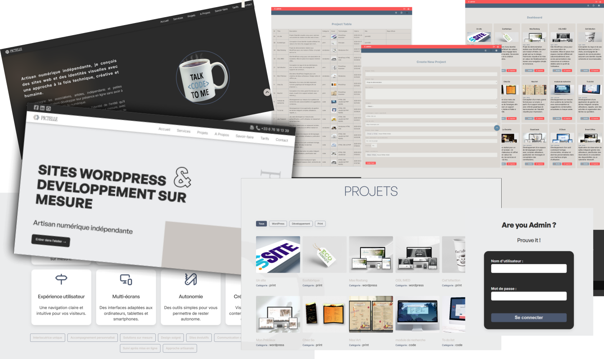

  

## **Digital Craftsmanship — Elegant websites, thoughtfully built.**  
Creating thoughtful, elegant websites with **WordPress** when flexibility matters, and **custom PHP** solutions when a project deserves a tailor-made solution.  
***Clean architecture, refined interfaces, and maintainable code — with an artisan’s touch.***

 

+ [About](#about)
+ [My tools](#my-tools)
+ [Featured work](#featured-work)
+ [Philosophy](#philosophy)
+ [Beyond the code](#beyond-the-code)

---

## About

> I’m Nadia, the developer behind Pictelle.  
I craft fast, accessible, and easy-to-manage websites, blending the versatility of WordPress with custom PHP development for projects built from the ground up.

Every project is designed with longevity in mind—focusing on a seamless user experience and meticulous attention to detail.  
Because I believe technology should support your ideas, never hinder them.

 

  

---

## My Tools

 
<table>
<tr>
<td align="center">FRONTEND</td>
<td align="center">BACKEND</td>
<td align="center">CMS</td>
<td align="center">WORKFLOW</td>
</tr>

<tr>

<td>

</td>

<td>

</td>

<td align="center">
 
Divi
</td>

<td>

</td>

</tr>
</table>
      
 

    
---

## Featured Work

   
  <table>
    <tr>
      <td>
        <strong>Custom MVC Portfolio</strong>
 
  <ul>
  <li>Authentication</li>
  <li>Admin dashboard</li>
  <li>Project management (CRUD)</li>
  <li>Media uploads</li>
  <li>Responsive interface</li>
  <li>SEO-ready architecture</li>
  <li>Modular JavaScript</li>
  <li>Reusable SVG component system</li>
  </ul>
  
   
  
  <strong>
    Every feature serves a purpose. Every detail supports the experience.
  </strong>
  
  </td>
    <td>
     
   </td>
  </tr>
</table>

  
### Additional templates and demonstration projects are currently in development.
    
---

## Philosophy

*To me, good code is more than just functional.  
It should remain understandable, elegant, scalable and enjoyable to maintain.
While technology keeps evolving, thoughtful design, clean architecture, and attention to detail remain timeless essentials.*

---

## Beyond the Code

Outside of development, I find inspiration in design, photography, nature, and quiet places.
These influences naturally shape my approach to building websites—clean, balanced, and focused on what truly matters.

---

   
<table>
   <tr>
      <td>   </td>
      <td align="center">
        <h3>
        Building digital experiences with the same care as handcrafted work.
        </h3>
      </td>
   </tr>
</table>

---

#### Workshop visitors

---

### [Website](https://pictelle.fr)

### [LinkedIn](https://linkedin.com/in/pictelle)

